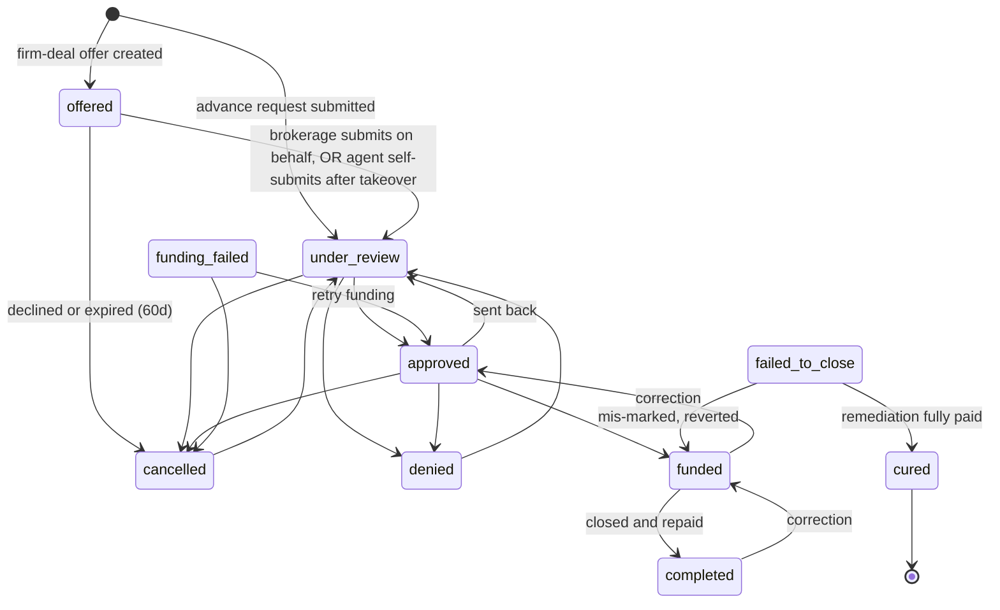

# Deal Lifecycle

_Last updated: 2026-06-11_

This document describes the full state machine a commission advance moves through, who can trigger each transition, the underwriting checklist, the settlement window and late-strike behavior, and the failed-deal cure path.

## 1. The statuses

Deal status is stored in the `deals.status` column. The full set is defined in `ALL_DEAL_STATUSES` in `lib/actions/deal-actions.ts` and the human labels live in `DEAL_STATUSES` / `STATUS_LABELS` in `lib/constants.ts`.

| Status | Meaning |
| --- | --- |
| `offered` | A proactive firm-deal offer was created; not yet a real request (see `firm-deals.md`) |
| `under_review` | Submitted as an advance request; Firm Funds is underwriting it |
| `approved` | Underwriting passed; ready to fund |
| `funded` | Money has been advanced to the agent; awaiting repayment at closing |
| `completed` | The deal closed and was repaid; happy-path terminal state |
| `denied` | Firm Funds declined the request (requires a reason) |
| `cancelled` | The request was withdrawn or an offer expired/declined |
| `funding_failed` | The electronic transfer bounced; can be retried |
| `failed_to_close` | A funded deal did not close; the agent owes the principal back |
| `cured` | A failed deal's balance was fully remediated; terminal state |

### Deal numbers

At submission (the moment a deal's status first leaves `offered`), every deal is stamped with a human-readable `deal_number` in the format `NNNN-MMDD-YY` (for example `0001-0609-26` is the first deal submitted on June 9, 2026). The `NNNN` sequence resets each day, and the date is the America/Toronto calendar date at submission. Firm-deal OFFERS (status `offered`) are leads, not submitted deals, so they are deliberately **not** numbered until they are actually submitted; an offer the brokerage never acts on never burns a number. The number is assigned by a database trigger that covers every creation path, so no app code assigns it. See [database.md](../architecture/database.md#deal_number_counters-migration-108).

## 2. The state machine

The authoritative transition map is `STATUS_FLOW` inside `updateDealStatus()` in `lib/actions/deal-actions.ts`. A transition that is not listed there is rejected with "Cannot transition from X to Y." The map deliberately allows some backward transitions so an admin can correct a mistake.

Note: `funding_failed` is reached from `funded` by a dedicated EFT-failure action (`oldValue funded -> newValue funding_failed` in `deal-actions.ts`), not through the generic `updateDealStatus` map. The "Retry funding" button (`retryFundingAfterFailure()`) flips the deal back to `approved` so the admin re-runs the standard approved -> funded path (re-deducting the agent balance once); it does not jump straight to `funded`. The generic `STATUS_FLOW` map still permits `funding_failed -> funded`/`cancelled` for manual correction.

### Transition table (who can trigger each)

| From | To | Triggered by | How |
| --- | --- | --- | --- |
| (new) | `offered` | Agent or system | Agent accepts a firm-deal offer (`acceptFirmDealOffer`), or the system auto-accepts a pre-requested offer when the agent's account is activated (`fireQueuedFirmDealOffersForAgent` -> `performFirmDealOfferAcceptance`; see §7) |
| (new) | `under_review` | Agent or brokerage admin | Submits an advance request (blocked while the agent has an uncovered failed-to-close balance — see §6, "Submission gate") |
| `offered` | `under_review` | Brokerage admin **or** the agent | Brokerage submits on the agent's behalf (`submitDealAsBrokerage` with `fromOfferDealId`), OR the agent takes the offer over (`agentTakeOverOffer`, sets `agent_self_submit_at`) and submits it themselves (`submitDeal` with `fromOfferDealId`). Both CONVERT the same offered row in place, so there is never a duplicate. While `agent_self_submit_at` is set the brokerage is paused (see `firm-deals.md` §5). |
| `offered` | `cancelled` | Brokerage admin or system cron | Declines, or the 60-day expiry cron fires. Both are blocked/skipped while `agent_self_submit_at` is set. |
| `under_review` | `approved` / `denied` / `cancelled` | Firm Funds admin | `updateDealStatus` (approval blocked until agent banking is verified). **Approving also auto-sends the contract for e-signature in one step** — best-effort: if the send fails (agent has no email, provider not configured, an active envelope already exists) the deal still approves and `result.data.autoSendWarning` is surfaced so the admin can send manually. Only fires on a genuine forward `under_review → approved`, never a `funded → approved` revert. |
| `approved` | `funded` | Firm Funds admin | One step: the single **Fund Deal** button opens a funding confirmation panel with a required **Reference #** field; submitting it both transitions the deal to `funded` **and** records the EFT transfer. The combined action is `fundDealWithEft` in `lib/actions/deal-actions.ts`, which simply reuses `updateDealStatus` (the funded transition) then `recordEftTransfer` (the `eft_transfers` insert + its guardrails) with no new money math; if the EFT record fails after a successful fund it returns success with a warning so the admin can re-record it. The standalone "EFT Transfers" section is now read-only transfer history with a secondary "record additional transfer" option for corrections. Posts an informational **Advance Issued** entry (`deal_advance`) to the agent's ledger for `amount_due_from_brokerage` (balance-neutral, for the statement only, see §6). |
| `approved` | `denied` / `cancelled` / `under_review` | Firm Funds admin | `updateDealStatus` |
| `funded` | `completed` | Firm Funds admin | Marks the deal repaid. **Requires confirmed brokerage payment(s) covering `amount_due_from_brokerage`** AND **no outstanding agent refund** (`refund_owed_amount` must be 0 — an early-closing or amendment credit must be paid out first via "Mark refund issued", `markRefundIssued`). Both are enforced server-side in `updateDealStatus`, not just by the UI button. **Side effect (best-effort, additive):** once the completion CAS wins, `updateDealStatus` calls `generateAndStoreCompletionReceipt` (`lib/invoices/completion-receipt.ts`), which builds a one-page receipt PDF (`lib/invoices/completion-receipt-pdf.ts`), stores it as a `completion_invoice` deal_documents row (`upload_source = 'system'`), and emails it to the agent with the PDF attached (`sendDealCompletionReceipt`). It is idempotent (dedupes on an existing `completion_invoice` row), touches **no** money math or balance/ledger RPC, and any PDF/storage/email failure is logged and swallowed so it never unwinds the completion. The receipt is agent-private (hidden from the brokerage portal via `BROKERAGE_HIDDEN_DOC_TYPES` because it shows the agent's service fee). |
| `funded` | `funded` (no status change) | Firm Funds admin | "Record Early Closing" (`recordEarlyClosing`): when the property closes before the scheduled date, refunds the prepaid discount fee for the days saved (on the `net_commission` basis, aligned with `calculateDeal` and the amendment path) and credits the agent. Sets `actual_closing_date` + `discount_refund_amount` + `refund_owed_amount` but does **not** complete the deal — completion now requires the brokerage payment **and** that the refund has been issued (`markRefundIssued`). |
| `funded` | `funding_failed` | Firm Funds admin | EFT-bounce action (reverses agent balance, and reverses the informational Advance Issued entry) |
| `funding_failed` | `approved` (via retry) / `cancelled` | Firm Funds admin | "Retry funding" reverts to `approved` to re-run the funding path; or cancel. (`STATUS_FLOW` also permits a direct `-> funded` manual correction.) |
| `failed_to_close` | `cured` | System | Set when remediation remittance fully clears the balance |
| `failed_to_close` | `funded` | Firm Funds admin | Revert if mis-marked |
| `denied` / `cancelled` | `under_review` | Firm Funds admin | Reopen |
| `cured` | (none) | n/a | Terminal |

Only `super_admin` and `firm_funds_admin` roles can call `updateDealStatus`. Agent and brokerage-admin transitions happen through dedicated, ownership-checked server actions (firm-deal accept/decline, advance submission).

### The "ready to fund" signal

A deal is **ready to fund** once it is `approved` **and both signed contracts have returned from the e-sign provider**: a `deal_documents` row of type `commission_agreement` (the signed CPA) **and** one of type `direction_to_pay` (the signed IDP) are present (the deal page also accepts both e-sign envelopes having reached `signed`). When that condition holds:

- The **admin dashboard** (`app/(dashboard)/admin/page.tsx`) surfaces a prominent **"N deals ready to fund"** banner listing those deals.
- The **admin deal page** (`app/(dashboard)/admin/deals/[id]/page.tsx`) shows a **"Ready to fund"** callout: both signed contracts are back and the deal is only waiting on Firm Funds to send the funds.

This is a signal only; it does not change any status. The admin still clicks **Fund Deal** to run the funded transition (above).

### Closing-date amendments (`approveClosingDateAmendment`)

An agent or brokerage admin can request a closing-date change on an `approved` or `funded` deal; a Firm Funds underwriter (capability `deal.underwrite`) approves it. Approval is idempotent (CAS on the amendment's `pending` status and on the deal's `closing_date`) so concurrent clicks cannot double-charge.

- **Approved (not yet funded):** the deal is fully re-priced from the new closing date. No agent charge or credit.
- **Funded:** the advance is locked. Only the discount fee changes, for the extra (or fewer) days between the old and new closing date (`computeFundedAmendmentDelta`, `net_commission` basis). Then:
  - The deal's `discount_fee`, `brokerage_referral_fee`, and `amount_due_from_brokerage` are recomputed (`computeAmendmentBrokerageRecalc`): the brokerage's profit share rises and its remittance falls by the brokerage's cut of the fee change on an extension (mirror image on a shortening). The brokerage keeps its share the net-remittance way; there is **no** brokerage ledger. The amended `amount_due_from_brokerage` is what the completion gate then requires.
  - The agent owes the full extra fee. It is posted to `account_balance` and a **targeted invoice** for exactly that amount is raised and emailed (`insertAgentInvoice` + `sendInvoiceNotification`). On a shortening the agent is **credited** instead (gated via `refund_owed_amount` / `markRefundIssued`); no invoice.
  - The **brokerage is emailed an amended-remittance notice** (old vs new amount due, with the reason) via `sendAmendedRemittanceNotification`, and the **agent's amendment-approved email discloses** the extra fee, the extra days, and the invoice.
  - The amended figures are snapshotted on the `closing_date_amendments` row (`old/new_brokerage_referral_fee`, `old/new_amount_due_from_brokerage`) and shown, flagged as amended, on the admin deal page and brokerage portal. The agent's amended CPA is sent for signature.

Because the extra fee is invoiced rather than deducted from the disbursed advance, after a funded amendment `advance_amount != net_commission - total_fees` on the deal row (expected; see `financial-model.md` §9).

## 3. The underwriting checklist

Every deal gets a fixed 12-item checklist when it is created, via a Postgres trigger (`create_underwriting_checklist()` in `supabase/migrations/017_underwriting_checklist_final.sql`). The list is locked: the migration header says "DO NOT MODIFY THIS LIST unless Bud explicitly asks for changes." Items are grouped into three categories.

| Category | Item |
| --- | --- |
| Agent Verification | Agent ID - FINTRAC Verification |
| Agent Verification | Agent has no outstanding recovery balance from previous fallen-through deals |
| Agent Verification | Agent in good standing with Brokerage (Not flagged) |
| Deal Verification | Agreement of Purchase and Sale, Schedules and Confirmation of Co-Operation |
| Deal Verification | Amendments |
| Deal Verification | Notices of Fulfillment/Waivers |
| Deal Verification | Trade Record - Agent/Brokerage Split verified |
| Deal Verification | Deal verified as unconditional |
| Deal Verification | Address verification on Google & Street View |
| Deal Verification | Double-check Discount Fee and Referral Fee Calculated Correctly |
| Firm Fund Documents | Commission Purchase Agreement - Signed and Executed |
| Firm Fund Documents | Irrevocable Direction to Pay - Signed and Executed |

Two items are auto-checked by the system rather than by hand:

- "Agent in good standing" is auto-checked at deal creation when the agent is not flagged by their brokerage.
- The two "Firm Fund Documents" items are auto-checked when the signed CPA and IDP arrive from DocuSign (the webhook links the signed document to the matching checklist item; see `integrations/docusign.md`).

#### Signed-file guard on the two contract items

The "Commission Purchase Agreement" and "Irrevocable Direction to Pay" checklist items **cannot be checked complete until a signed file is actually attached**. `toggleChecklistItem` (in `lib/actions/deal-actions.ts`) rejects checking either item ON unless there is evidence of the signed contract: a linked document (`linked_document_id` or any `linked_document_ids`), **or** a `deal_documents` row of the matching type (`commission_agreement`/`cpa` for the CPA, `direction_to_pay`/`idp` for the IDP). The signed-doc lookup uses the service-role client so the check cannot be defeated by a row the caller's RLS hides. This is server-enforced (with a client-side pre-check for a friendlier error), and only blocks checking ON; unchecking is always allowed. In normal operation the webhook auto-links the returned signed PDF and auto-checks the item, so the guard only bites when someone tries to tick the box before the signed contract is back.

## 4. Settlement window and late strikes

After a deal closes, the brokerage has a settlement window to remit the amount due to Firm Funds. The standard window is 7 days (`SETTLEMENT_PERIOD_DAYS`).

The effective window for a given brokerage is resolved by `effectiveSettlementDays()` in `lib/calculations.ts`, in priority order:

1. An admin manual override (`settlement_days_override`), if set and positive.
2. The auto-bumped 14-day window, if `auto_bumped_to_14_days_at` is set.
3. Otherwise the standard 7 days.

The window in force when a deal is submitted is snapshotted into `deals.settlement_days_at_funding`, so later changes to the brokerage's settings do not retroactively change a funded deal's terms.

### The auto-bump

A brokerage that misses the 7-day settlement window accumulates "late strikes." After `BROKERAGE_LATE_STRIKE_THRESHOLD` (5) strikes, the brokerage's effective settlement window auto-bumps from 7 to `BROKERAGE_BUMPED_SETTLEMENT_DAYS` (14) days, recorded by setting `auto_bumped_to_14_days_at`. The strike-tracking columns (`late_strike_count`, `auto_bumped_to_14_days_at`, `last_strike_reset_at`, `settlement_days_override`) are internal Firm Funds data and are excluded from `BROKERAGE_PUBLIC_COLUMNS`, so they are never exposed to the brokerage's own portal or its agents.

## 5. Late interest after closing

If a closed deal is not remitted, the unpaid balance accrues 24% per year compounded daily, starting on day 31 after closing (a 30-day grace). The math is in `financial-model.md`, section 6. Days 1 to 7 are the settlement window; days 8 to 30 are a follow-up window where Firm Funds is meant to be contacting the brokerage; day 31 onward accrues interest until cleared.

## 6. The failed-deal path: failed_to_close, cure election, Remediation IDP, cured

A funded deal that does not close at all follows a separate remediation track.

### Step 1: mark failed_to_close

An admin moves a funded deal to `failed_to_close`, stamping `failed_to_close_at`, the `failure_type`, and a `failure_reason` (in `lib/actions/deal-actions.ts`). The agent now owes back the advanced principal. From the failure timestamp, a fresh 30-day grace runs; on day 31 the principal begins compounding at 24% per year via `liveFailedDealInterestOwed()` (`failedDealAccrualStartDate` provides the anchor).

### Step 2: cure election

The agent must elect how to satisfy the outstanding balance. The election is recorded on the deal (`cure_election`, `cure_election_at`, `cure_election_deadline`) and is one of:

- `cash_repayment` (pay the balance back directly), or
- `commission_assignment` (assign a future commission to Firm Funds).

The admin triage view (`getPendingCureElections` in `lib/actions/cure-actions.ts`) surfaces, per failed deal: the outstanding principal, posted interest, live interest total, unposted interest, the live balance owed, the accrual start date, and whether the deal is still in grace.

### Step 3: the Remediation IDP

For the commission-assignment route, the admin creates a `remediation_deals` record capturing the new property, the brokerage, and the directed amount (typically the live failed-deal balance). Firm Funds sends a Remediation Direction to Pay (a Remediation IDP) to the agent and the broker of record through DocuSign. The remediation lifecycle is its own status chain: `pending -> idp_sent -> idp_signed -> remitted` (with `cancelled` as an escape). See `integrations/docusign.md` for the signing and storage mechanics.

Importantly, a Remediation IDP is **not a new advance**: no discount fee, settlement fee, or referral fee applies. Its only job is to route the agent's next commission to Firm Funds to reduce the outstanding balance.

### Step 4: cured

When the remediation remittance fully clears the outstanding balance, the failed deal is moved to `cured` (the write happens in `lib/actions/remediation-actions.ts`, CAS-guarded on the prior values). `cured` is terminal. The recently-cured list keys off `failed_deal_interest_calculated_at` as the effective cure timestamp.

A `remediation-overdue-escalation` cron (`app/api/cron/remediation-overdue-escalation/route.ts`) keeps overdue remediations on the radar.

### Submission gate (new advances blocked while a failed-deal balance is uncovered)

An agent who has any `failed_to_close` deal with a remaining `outstanding_balance` cannot have a **new** advance submitted until approved advances already in the pipeline cover what they owe. The rule (`evaluateFailedDealGate` in `lib/actions/deal-actions.ts`):

- **Trigger** — the agent has at least one `failed_to_close` deal with `outstanding_balance > 0`.
- **Owed** — the agent's full current `account_balance` (everything they owe Firm Funds, including posted interest).
- **Coverage** — the combined `advance_amount` of the agent's `approved` (not-yet-funded) deals. When those fund, the balance-deduction at funding pays the debt down.
- **Blocked** — coverage does not reach owed (cent tolerance).

Enforced server-side in both `submitDeal` (agent self-serve) and `submitDealAsBrokerage` (brokerage on behalf), so neither entry point can bypass it. The agent and brokerage new-deal pages also call `getDealSubmissionGate` to warn up front and disable the submit button, but the server check is authoritative.

### Statement entries: Advance Issued / Repayment Received (migration 106)

So an agent's ledger reads like a bank statement, two **informational** entries are posted alongside the money flow:

- **Advance Issued** (`deal_advance`) — posted when a deal is funded, for `amount_due_from_brokerage` (the outstanding balance the brokerage will repay). Posted in `updateDealStatus`'s funded branch after the optimistic-lock CAS wins.
- **Repayment Received** (`deal_repayment`) — posted when a brokerage payment is confirmed received, for that payment's amount. Posted in `recordBrokeragePayment` (admin records a confirmed payment) and in `reviewBrokeragePaymentClaim` when an admin confirms a brokerage-submitted claim. Partial/multiple payments each post their own line; pending and rejected claims post nothing.

Both go through the balance-neutral `record_agent_statement_entry` RPC, so they **never change `account_balance`** and therefore never trigger late-payment interest or get netted against a future advance — a funded advance the brokerage repays is not agent debt. On a clean deal the Advance Issued charge and the Repayment Received payment net to zero. If a funded deal is reverted to `approved` or marked `funding_failed`, the Advance Issued entry is reversed so the statement does not show a phantom advance. All posting is best-effort: the money path commits first, and a failed statement insert is logged for manual reconciliation but never unwinds funding or payment confirmation. The helpers live in `lib/agent-statement.ts`.

## 7. Agent onboarding and activation

Before an agent can transact, they pass through onboarding. An agent's `account_activated_at` is set automatically (trigger `set_agent_account_activated()`, migration 043) once their KYC is verified **and** their banking is approved. Until then the deal-approval step is blocked: an admin cannot move a deal `under_review -> approved` while the agent's banking is unverified.

#### Firm-deal pre-request fires on activation

An agent who onboarded via a firm-deal offer link can "pre-request" that advance from the "You're all set" pending page before their account is approved (it records the intent rather than notifying the brokerage). The three approval actions that can flip `account_activated_at` (`verifyAgentKyc`, `brokerageVerifyAgentKyc`, and `approveAgentBanking`) each call `fireQueuedFirmDealOffersForAgent` at the end, which, once the account is fully activated, automatically runs the normal offer acceptance on the agent's behalf (creates the `offered` deal and notifies the brokerage). It is best-effort and no-ops if the account is not yet activated. The migration-043 trigger that sets `account_activated_at` is unchanged. See `firm-deals.md` §5 ("Pre-request: request-on-approval") for the full flow.

### Banking: void cheque / direct deposit + deposit authorization

Agent onboarding requires two things before banking can be submitted (enforced in `submitAgentBanking`, `lib/actions/profile-actions.ts`):

1. **A void cheque OR direct deposit authorization form** uploaded to the existing `agent-preauth-forms` storage bucket (path stored on `agents.preauth_form_path`). Admins review it on the agent banking row via the "View void cheque / direct deposit" button (relabeled from the old preauth-form wording).
2. **The mandatory deposit-authorization consent**: the agent must check "I authorize Firm Funds Inc. to deposit payments into this account." `submitAgentBanking` will not accept banking unless its `authorizeDeposit` flag is set, and it stamps `agents.deposit_authorized_at` / `agents.deposit_authorized_by` (migration 107) to record the consent.

### Agent dashboard states

The agent dashboard (`app/(dashboard)/agent/page.tsx`) distinguishes three states so an agent always sees the right next step:

- **Continue setup**: onboarding is genuinely incomplete (KYC and/or banking not yet submitted). The agent is pointed back to the remaining steps.
- **Pending approval**: everything is submitted and the agent is waiting on staff to approve KYC and banking. This is a new state, separate from "Continue setup": there is nothing for the agent to do but wait.
- **Active**: KYC verified and banking approved (`account_activated_at` set); the agent can transact.

The dashboard also greets first-time users with "Welcome, {name}" and returning users with "Welcome back, {name}", driven by `user_profiles.welcomed_at` (migration 107): NULL means the user has never been greeted, so they get the first-time greeting and the flag is stamped once.

## 8. Portal visibility

### Brokerage file visibility (and the hidden types)

The brokerage portal (`app/(dashboard)/brokerage/page.tsx`) shows a brokerage **all** deal documents for their own deals (signed contracts, directions to pay, brokerage cooperation agreements, amendments, trade records, supporting files), not just the trade record, so they can see what is on a deal and spot what is missing. Each file opens via the role-scoped `getDocumentSignedUrl` action (which authorizes that the brokerage admin actually administers the deal's brokerage before minting a signed URL).

Two categories are deliberately **hidden** from the brokerage, filtered out by `BROKERAGE_HIDDEN_DOC_TYPES` (unknown/new types default to visible, so only this set is hidden):

- **Agent-private identity and banking docs**: `kyc_fintrac`, `id_verification`, `banking_info`.
- **The deal-completion receipt**: `completion_invoice` (and the reserved `receipt`), because it shows the agent's service fee, which is effectively Firm Funds' margin. The agent still sees this on their own deal documents; the brokerage never does.

### Closing-date amendment indicators

When a deal's closing date has been amended, both the **brokerage portal** and the **agent deal page** (`app/(dashboard)/agent/deals/[id]/page.tsx`) now display a "Closing date amended" indicator showing the old date to the new date, with a link to the executed amendment document (resolved from the amendment's `amendment_document_id`). The closing date shown elsewhere already reflects the amendment; this indicator makes the change explicit. Previously only the admin portal surfaced it.
