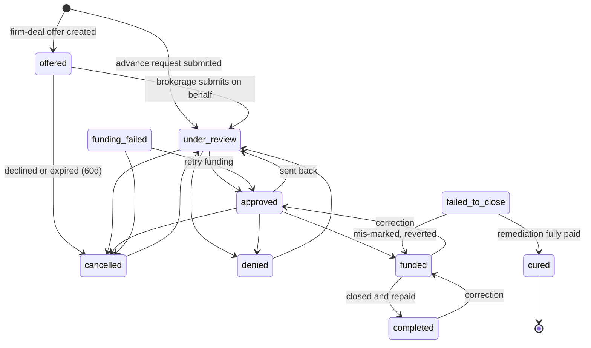

# Deal Lifecycle

_Last updated: 2026-06-02_

This document describes the full state machine a commission advance moves through, who can trigger each transition, the underwriting checklist, the settlement window and late-strike behavior, and the failed-deal cure path.

## 1. The statuses

Deal status is stored in the `deals.status` column. The full set is defined in `ALL_DEAL_STATUSES` in `lib/actions/deal-actions.ts` and the human labels live in `DEAL_STATUSES` / `STATUS_LABELS` in `lib/constants.ts`.

| Status | Meaning |
| --- | --- |
| `offered` | A proactive firm-deal offer was created; not yet a real request (see `firm-deals.md`) |
| `under_review` | Submitted as an advance request; Firm Funds is underwriting it |
| `approved` | Underwriting passed; ready to fund |
| `funded` | Money has been advanced to the agent; awaiting repayment at closing |
| `completed` | The deal closed and was repaid; happy-path terminal state |
| `denied` | Firm Funds declined the request (requires a reason) |
| `cancelled` | The request was withdrawn or an offer expired/declined |
| `funding_failed` | The electronic transfer bounced; can be retried |
| `failed_to_close` | A funded deal did not close; the agent owes the principal back |
| `cured` | A failed deal's balance was fully remediated; terminal state |

## 2. The state machine

The authoritative transition map is `STATUS_FLOW` inside `updateDealStatus()` in `lib/actions/deal-actions.ts`. A transition that is not listed there is rejected with "Cannot transition from X to Y." The map deliberately allows some backward transitions so an admin can correct a mistake.

Note: `funding_failed` is reached from `funded` by a dedicated EFT-failure action (`oldValue funded -> newValue funding_failed` in `deal-actions.ts`), not through the generic `updateDealStatus` map. The "Retry funding" button (`retryFundingAfterFailure()`) flips the deal back to `approved` so the admin re-runs the standard approved -> funded path (re-deducting the agent balance once); it does not jump straight to `funded`. The generic `STATUS_FLOW` map still permits `funding_failed -> funded`/`cancelled` for manual correction.

### Transition table (who can trigger each)

| From | To | Triggered by | How |
| --- | --- | --- | --- |
| (new) | `offered` | Agent | Accepts a firm-deal offer (`acceptFirmDealOffer`) |
| (new) | `under_review` | Agent or brokerage admin | Submits an advance request (blocked while the agent has an uncovered failed-to-close balance — see §6, "Submission gate") |
| `offered` | `under_review` | Brokerage admin | Submits the offered deal on the agent's behalf |
| `offered` | `cancelled` | Brokerage admin or system cron | Declines, or the 60-day expiry cron fires |
| `under_review` | `approved` / `denied` / `cancelled` | Firm Funds admin | `updateDealStatus` (approval blocked until agent banking is verified) |
| `approved` | `funded` | Firm Funds admin | Marks the deal funded after the EFT is sent |
| `approved` | `denied` / `cancelled` / `under_review` | Firm Funds admin | `updateDealStatus` |
| `funded` | `completed` | Firm Funds admin | Marks the deal repaid. **Requires confirmed brokerage payment(s) covering `amount_due_from_brokerage`** — enforced server-side in `updateDealStatus`, not just by the UI button. |
| `funded` | `funded` (no status change) | Firm Funds admin | "Record Early Closing" (`recordEarlyClosing`): when the property closes before the scheduled date, refunds the prepaid discount fee for the days saved and credits the agent. Sets `actual_closing_date` + `discount_refund_amount` but does **not** complete the deal — completion still requires the brokerage payment. |
| `funded` | `funding_failed` | Firm Funds admin | EFT-bounce action (reverses agent balance) |
| `funding_failed` | `approved` (via retry) / `cancelled` | Firm Funds admin | "Retry funding" reverts to `approved` to re-run the funding path; or cancel. (`STATUS_FLOW` also permits a direct `-> funded` manual correction.) |
| `failed_to_close` | `cured` | System | Set when remediation remittance fully clears the balance |
| `failed_to_close` | `funded` | Firm Funds admin | Revert if mis-marked |
| `denied` / `cancelled` | `under_review` | Firm Funds admin | Reopen |
| `cured` | (none) | n/a | Terminal |

Only `super_admin` and `firm_funds_admin` roles can call `updateDealStatus`. Agent and brokerage-admin transitions happen through dedicated, ownership-checked server actions (firm-deal accept/decline, advance submission).

## 3. The underwriting checklist

Every deal gets a fixed 12-item checklist when it is created, via a Postgres trigger (`create_underwriting_checklist()` in `supabase/migrations/017_underwriting_checklist_final.sql`). The list is locked: the migration header says "DO NOT MODIFY THIS LIST unless Bud explicitly asks for changes." Items are grouped into three categories.

| Category | Item |
| --- | --- |
| Agent Verification | Agent ID - FINTRAC Verification |
| Agent Verification | Agent has no outstanding recovery balance from previous fallen-through deals |
| Agent Verification | Agent in good standing with Brokerage (Not flagged) |
| Deal Verification | Agreement of Purchase and Sale, Schedules and Confirmation of Co-Operation |
| Deal Verification | Amendments |
| Deal Verification | Notices of Fulfillment/Waivers |
| Deal Verification | Trade Record - Agent/Brokerage Split verified |
| Deal Verification | Deal verified as unconditional |
| Deal Verification | Address verification on Google & Street View |
| Deal Verification | Double-check Discount Fee and Referral Fee Calculated Correctly |
| Firm Fund Documents | Commission Purchase Agreement - Signed and Executed |
| Firm Fund Documents | Irrevocable Direction to Pay - Signed and Executed |

Two items are auto-checked by the system rather than by hand:

- "Agent in good standing" is auto-checked at deal creation when the agent is not flagged by their brokerage.
- The two "Firm Fund Documents" items are auto-checked when the signed CPA and IDP arrive from DocuSign (the webhook links the signed document to the matching checklist item; see `integrations/docusign.md`).

## 4. Settlement window and late strikes

After a deal closes, the brokerage has a settlement window to remit the amount due to Firm Funds. The standard window is 7 days (`SETTLEMENT_PERIOD_DAYS`).

The effective window for a given brokerage is resolved by `effectiveSettlementDays()` in `lib/calculations.ts`, in priority order:

1. An admin manual override (`settlement_days_override`), if set and positive.
2. The auto-bumped 14-day window, if `auto_bumped_to_14_days_at` is set.
3. Otherwise the standard 7 days.

The window in force when a deal is submitted is snapshotted into `deals.settlement_days_at_funding`, so later changes to the brokerage's settings do not retroactively change a funded deal's terms.

### The auto-bump

A brokerage that misses the 7-day settlement window accumulates "late strikes." After `BROKERAGE_LATE_STRIKE_THRESHOLD` (5) strikes, the brokerage's effective settlement window auto-bumps from 7 to `BROKERAGE_BUMPED_SETTLEMENT_DAYS` (14) days, recorded by setting `auto_bumped_to_14_days_at`. The strike-tracking columns (`late_strike_count`, `auto_bumped_to_14_days_at`, `last_strike_reset_at`, `settlement_days_override`) are internal Firm Funds data and are excluded from `BROKERAGE_PUBLIC_COLUMNS`, so they are never exposed to the brokerage's own portal or its agents.

## 5. Late interest after closing

If a closed deal is not remitted, the unpaid balance accrues 24% per year compounded daily, starting on day 31 after closing (a 30-day grace). The math is in `financial-model.md`, section 6. Days 1 to 7 are the settlement window; days 8 to 30 are a follow-up window where Firm Funds is meant to be contacting the brokerage; day 31 onward accrues interest until cleared.

## 6. The failed-deal path: failed_to_close, cure election, Remediation IDP, cured

A funded deal that does not close at all follows a separate remediation track.

### Step 1: mark failed_to_close

An admin moves a funded deal to `failed_to_close`, stamping `failed_to_close_at`, the `failure_type`, and a `failure_reason` (in `lib/actions/deal-actions.ts`). The agent now owes back the advanced principal. From the failure timestamp, a fresh 30-day grace runs; on day 31 the principal begins compounding at 24% per year via `liveFailedDealInterestOwed()` (`failedDealAccrualStartDate` provides the anchor).

### Step 2: cure election

The agent must elect how to satisfy the outstanding balance. The election is recorded on the deal (`cure_election`, `cure_election_at`, `cure_election_deadline`) and is one of:

- `cash_repayment` (pay the balance back directly), or
- `commission_assignment` (assign a future commission to Firm Funds).

The admin triage view (`getPendingCureElections` in `lib/actions/cure-actions.ts`) surfaces, per failed deal: the outstanding principal, posted interest, live interest total, unposted interest, the live balance owed, the accrual start date, and whether the deal is still in grace.

### Step 3: the Remediation IDP

For the commission-assignment route, the admin creates a `remediation_deals` record capturing the new property, the brokerage, and the directed amount (typically the live failed-deal balance). Firm Funds sends a Remediation Direction to Pay (a Remediation IDP) to the agent and the broker of record through DocuSign. The remediation lifecycle is its own status chain: `pending -> idp_sent -> idp_signed -> remitted` (with `cancelled` as an escape). See `integrations/docusign.md` for the signing and storage mechanics.

Importantly, a Remediation IDP is **not a new advance**: no discount fee, settlement fee, or referral fee applies. Its only job is to route the agent's next commission to Firm Funds to reduce the outstanding balance.

### Step 4: cured

When the remediation remittance fully clears the outstanding balance, the failed deal is moved to `cured` (the write happens in `lib/actions/remediation-actions.ts`, CAS-guarded on the prior values). `cured` is terminal. The recently-cured list keys off `failed_deal_interest_calculated_at` as the effective cure timestamp.

A `remediation-overdue-escalation` cron (`app/api/cron/remediation-overdue-escalation/route.ts`) keeps overdue remediations on the radar.

### Submission gate (new advances blocked while a failed-deal balance is uncovered)

An agent who has any `failed_to_close` deal with a remaining `outstanding_balance` cannot have a **new** advance submitted until approved advances already in the pipeline cover what they owe. The rule (`evaluateFailedDealGate` in `lib/actions/deal-actions.ts`):

- **Trigger** — the agent has at least one `failed_to_close` deal with `outstanding_balance > 0`.
- **Owed** — the agent's full current `account_balance` (everything they owe Firm Funds, including posted interest).
- **Coverage** — the combined `advance_amount` of the agent's `approved` (not-yet-funded) deals. When those fund, the balance-deduction at funding pays the debt down.
- **Blocked** — coverage does not reach owed (cent tolerance).

Enforced server-side in both `submitDeal` (agent self-serve) and `submitDealAsBrokerage` (brokerage on behalf), so neither entry point can bypass it. The agent and brokerage new-deal pages also call `getDealSubmissionGate` to warn up front and disable the submit button, but the server check is authoritative.
